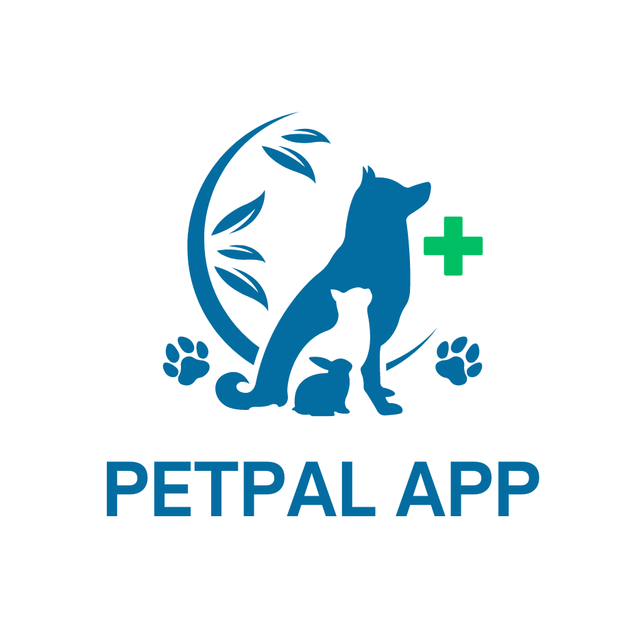

    

## 📄 About the Project

PetPal App is a specialized platform for pet needs. This application provides various features that make it easier for pet owners to purchase items and consult with veterinarians, either through online consultations or visits.

## 🚀 Technology Stack

## 💎 Features

### 👤 Admin

- Create Account
- Login Account
- Sell Product
- Medical Check-up Services
- Chatting with User (Online Consultation)

### 👥 User

- Create Account
- Login Account
- Chatting with Veterinary (Online Consultation)
- Simulation Payment with Midtrans
- Edit Profile
- Buy Animal Product and Medical Check-up Services

## 🔗 Deployment

https://petpal-nu.vercel.app/
